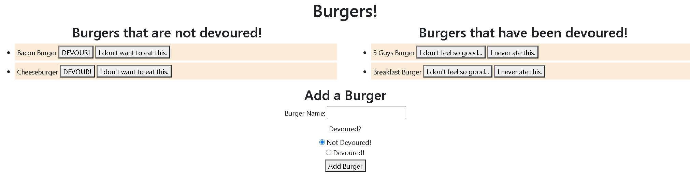

# nodexpresshandlebars

## Project Title

nodeexpresshandlebars

## Project Link

- https://github.com/jamesrowe1/nodeexpresshandlebars
- https://jamesrowe-nodeexpresshandle.herokuapp.com/

## Screenshot

## Getting Started

Begin by navigating to the herokup app link above. At this time you will be presented with a web page titled "Burgers!".

Burgers that have not yet been devoured will appear on the left, with two buttons. The first will be "DEVOUR!", which will "eat" the burger and move it to the right ("Burgers that have been devoured").

Burgers that have been devoured will appear on the left, with two buttons. The first will be "I don't feel so good..." which will "undevour" the burger, and move it to the column on the left. If this was in this column by mistake, you can remove it by clicking the "I never ate this." button.

You can add a new burger to eat by filling in the Add a Burger form at the bottom and clicking the "Add Burger" button. You have the option to set the burger as already devoured.

## Prerequisites

You must have a working web browser

## Built With

- Visual Studio Code
- JavaScript
- Node
  - mysql
  - express
  - express-handlebars
- Code hosted by Github
- App hosted by Heroku

## Authors

James Rowe

## License

Licensed under Awesome Coding L.L.C. (not a real company)

## Troubleshooting

For any issues contact James Rowe

## Acknowledgments

- Ben Wright
- Justin Pinero
- Wilson Linares